# Role Relation Map

## Structure Overview

All subagents are dispatched directly by the main agent. There is no extra nesting or further spawning.

- `ts-critic` also plays the time-series expert role and the Pareto stop-go role. We no longer keep separate `ts-expert` or `gamer` roles.
- `c-critic` is the cold-start critique role with minimal context. It joins only in the final pre-stop gate and does not join the earlier explanation chain.
- Before every closeout, the main agent must run one pre-stop gate in the order `brain-storm -> deep-reasoning -> ts-critic -> c-critic`. If any step finds remaining actions, the main loop restarts.
- Key skills fill process gaps. They do not replace role boundaries.
- `progress`, `features`, `decisions`, `todo-map`, and `completion-gate` are runtime artifacts. The main agent maintains them, and `ts-critic` / `c-critic` read them.

```mermaid
graph TD
    P[Primary Agent]

    RA[requirements-analyst]
    IC[information-collector]
    CO[coder]
    TSC[ts-critic]
    CC[c-critic]

    P -->|owns| RA
    P -->|owns| IC
    P -->|owns| CO
    P -->|owns| TSC
    P -->|owns| CC

    P -.init.-> WI[workspace-init]
    P -.plan frame.-> PL[plan]
    P -.pre-step safety gate.-> SG[safety-gate]
    P -.dispatch protocol.-> DP[dispatch]
    P -.reportback protocol.-> RB[reportback]
    P -.runtime events.-> RE[runtime-events]
    P -.memory sync.-> MS[memory-sync]
    P -.attachment intake.-> PI[pdf-intake]
    P -.data unification.-> DI[data-interface]
    P -.branch expansion.-> BS[brain-storm]
    P -.deep reasoning.-> DR[deep-reasoning]
    P -.pre-stop gate.-> BS
    P -.pre-stop gate.-> DR
    P -.structural evolution.-> EV[evolution]
    P -.eval contracts.-> ES[evals/*]
    P -.runtime artifacts.-> PG[progress/features/decisions/todo-map/completion-gate]
    IC -.GitHub evidence.-> GH[github-search]
    IC -.time-series search frame.-> TSS[time-series]
    CO -.experiment execution.-> ZX[ztxexp]
    TSC -.pre/post-step review and governance.-> CL[critic-loop]
    TSC -.pre-stop governance.-> BS
    TSC -.pre-stop governance.-> DR
    TSC -.time-series review.-> TSS
    TSC -.report delivery.-> RW[report-writing]
    TSC -.stop/go.-> SGP[stop-go]
    TSC -.rebuttal.-> RBP[rebuttal]
    CC -.final minimal-context review.-> SGP
    CC -.read artifacts.-> PG
```

## Edge Type Notes

| Edge Label | Meaning |
| ---------- | ------- |
| `owns` | The agent belongs directly to the main agent and is dispatched by the main agent |
| `calls` | The main agent or a subagent triggers the related skill when needed |
