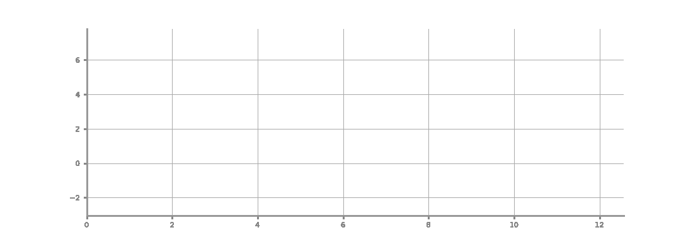

<p align="center">
  
</p>

<h1 align="center">
  
</h1>

<p align="center">
  <a href="README.md"><strong>English</strong></a> ·
  <a href="README.zh-CN.md"><strong>简体中文</strong></a>
</p>

## News

**2026-08-07 — AION moves from a heavyweight fixed workflow to adaptive execution with aggressively compressed context.**

**AION** is a time-series harness — an explicit control layer that connects task specification, runtime execution, and result assessment into one stable process for next-generation time-series workloads.

Time-series research is moving beyond fixed forecasting benchmarks toward tasks that combine prediction, contextual reasoning, tool use, and structured decision support. AION formalizes these as triples of _task file, workspace, and validation interface_, organizing the system around multi-agent dispatch with layered review gates.

<p align="center">
  <a href="#-quick-start"></a>
  <a href="#-components"></a>
  <a href="LICENSE"></a>
  <a href="https://arxiv.org/abs/2605.25045"></a>
</p>

<p align="center">
  
  
  
  
  
  
  
  
  
  <a href="https://github.com/ztxtech/aion"></a>
  
  <a href="https://deepwiki.com/ztxtech/aion"></a>
</p>

---

## ✨ What is AION?

Existing benchmarks and agent-centered systems each capture only part of the shift toward next-generation time-series tasks: benchmarks usually simplify the task too early, while agents alone do not provide temporal contracts, evidence discipline, or reliable stopping criteria.

AION addresses this gap as a **time-series harness** built on [OpenCode](https://github.com/anomalyco/opencode). It structures work through specialized agents — requirement analysis, evidence collection, implementation, and layered review — with protocols that govern dispatch, report-back, rebuttal, and stop-go decisions.

Time-series specialization enters through **temporal grounding**, **knowledge-grounded search**, and **layered reliability checks**, allowing the system to work with open-ended evidence while preserving output legality and stop discipline.

---

## 🏗️ Architecture

AION organizes work through named agents, native OpenCode skills, runtime protocols, memory files, evaluation contracts, and a fail-closed CLI runner. The main agent adapts the route to task level and model capability; `ts-critic` and `c-critic` remain the review backbone.

### Directory Structure

```
.opencode/
├── agents/           # 6 specialized agents
│   ├── agent.md              # Main orchestrator (mode: primary)
│   ├── requirements-analyst  # Task intake & requirement extraction
│   ├── information-collector # External evidence & SOTA search
│   ├── coder.md              # Implementation, experiments & delivery
│   ├── ts-critic.md          # Time-series expert + Pareto governance
│   └── c-critic.md           # Final minimal-context cold-start critic
├── skills/            # Native OpenCode skills, loaded on demand
│   ├── workspace-init/       # Runtime bootstrap, memory, and trace
│   ├── safety/               # Input and action safety checks
│   ├── search/               # Multi-axis external evidence collection
│   ├── planning/             # Planning and branch management
│   ├── ts-core/              # Time-series task and validation rules
│   ├── experiment/           # Benchmark-first experiment execution
│   ├── report/               # Evidence-bound report delivery
│   └── pdf-intake/           # Read-only PDF extraction
├── rules/            # Kernel rules
│   ├── core.md               # Kernel: governance, task levels, model profile, memory
│   └── opencode.md           # OpenCode docs & repo reference
├── protocols/        # 8 runtime protocols
│   ├── dispatch.md           # Subagent dispatch contract
│   ├── reportback.md         # Report-back contract
│   ├── rebuttal.md           # Rebuttal protocol
│   ├── stop-go.md            # Stop/go governance
│   ├── lifecycle.md          # Agent lifecycle management
│   ├── memory-sync.md        # Memory synchronization
│   ├── runtime-events.md     # Runtime event tracking
│   └── compaction.md         # Context compaction protocol
├── evals/            # 5 evaluation contracts
│   ├── suites.md             # Test suite definitions
│   ├── graders.md            # Grader specifications
│   ├── scorecards.md         # Scorecard templates
│   ├── regression-matrix.md  # Regression test matrix
│   └── release-gates.md      # Release gate criteria
├── memory/
│   └── template/     # 11 memory templates
│       ├── initial-prompt.md  # Anti-drift task baseline
│       ├── context-snapshot.md # Canonical compaction artifact
│       ├── progress.md        # Task progress tracking
│       ├── decisions.md       # Key decision log
│       ├── features.md        # Feature inventory
│       ├── todo-map.md        # Frontier & TODO tracking
│       ├── completion-gate.md # Completion checklist
│       ├── positive.md        # Positive findings pool
│       ├── negative.md        # Negative findings pool
│       ├── relation.md        # Agent relationship graph
│       ├── memory.md          # Persistent memory
│       ├── dir.md             # Directory structure
│       └── trace.md           # Trace template seed
└── .gitignore
```

---

## 🚀 Quick Start

### 0. Prerequisites

AION requires a standard Linux/macOS environment with these system commands available:

| Command         | Used by                                   | Notes                 |
| --------------- | ----------------------------------------- | --------------------- |
| `git`           | Clone .opencode, local checkpoint history | Usually pre-installed |
| `curl`          | Download AION, web search fallback        | Usually pre-installed |
| `tar` / `unzip` | Extract archives                          | Usually pre-installed |
| `python3`       | Python toolchain, validators              | ≥ 3.10 recommended    |
| `bash`          | cli.sh and skill scripts                  | ≥ 4.0                 |

Some commands (e.g. installing `git`, `curl`, or `unzip` via package manager) may require **root/sudo** access. On minimal containers or CI images, install them before proceeding:

```bash
# Debian / Ubuntu
sudo apt-get update && sudo apt-get install -y git curl unzip tar python3

# RHEL / CentOS / Fedora
sudo dnf install -y git curl unzip tar python3

# macOS (usually pre-installed; if not)
brew install git curl python3
```

### 1. Install OpenCode

```bash
# YOLO
curl -fsSL https://opencode.ai/install | bash

# Package managers
npm i -g opencode-ai@latest        # or bun/pnpm/yarn
scoop install opencode             # Windows
choco install opencode             # Windows
brew install anomalyco/tap/opencode # macOS and Linux (recommended, always up to date)
brew install opencode              # macOS and Linux (official brew formula, updated less)
sudo pacman -S opencode            # Arch Linux (Stable)
paru -S opencode-bin               # Arch Linux (Latest from AUR)
mise use -g opencode               # Any OS
nix run nixpkgs#opencode           # or github:anomalyco/opencode for latest dev branch
```

### 2. Configure OpenCode

```bash
opencode    # launch the TUI, then pick a provider and authenticate when prompted
```

Supports **Claude / OpenAI / Codex / Copilot / Gemini** and any compatible endpoint.

### 3. Add AION to Your Project

```bash
# Option A: Clone into your project root
cd your-project
git clone https://github.com/ztxtech/aion.git .opencode

# Option B: Download and extract
curl -fsSL https://github.com/ztxtech/aion/archive/refs/heads/main.tar.gz | tar xz --strip-components=1
mv aion-main/.opencode .opencode
rm -rf aion-main
```

### 4. Run

```bash
# Interactive TUI mode
opencode

# Non-interactive run mode
opencode run --agent agent "Your task description here"

# With a specific model
opencode run --agent agent -m anthropic/claude-sonnet-4 "Analyze this time-series dataset"
```

### Run Modes vs Execution Strategies

OpenCode's `run` and `tui` describe the interface shape, not the same thing as how much the agent should ask the user.

- `run`
  This is the non-interactive execution surface. In this template, `run` is paired with `autonomous` by default: the agent should detect local context, pick the default best path, and keep going without pausing for routine environment or workflow choices.
- `tui`
  This is the interactive terminal interface. In this template, `tui` may still run in `autonomous`, or it may run in `interactive` when the user explicitly wants to participate in key forks.
- `tui + autonomous`
  The user is present and can observe the session, but the agent still defaults to making routine decisions on its own. Being inside TUI does not mean the agent should start asking about every low-risk default.
- `tui + interactive`
  Use this only when the user explicitly wants to co-decide important forks. Even then, the agent should still perform local detection first, and only ask when multiple equally reasonable options remain and those options would materially change the later path.
- `run + interactive`
  This template does not treat this as a supported default combination. `run` is intended to keep moving autonomously; if the workflow should pause for key user choices, `tui` is the better fit.

For Python environments, the default decision tree is:

- decide whether Python is actually needed
- reuse an existing workspace-root `.venv` if one already exists
- otherwise follow stronger project constraints such as `pyproject.toml`, `.python-version`, `environment.yml`, `requirements*.txt`, or `uv.lock`
- only then create a workspace-root `.venv`

In `autonomous`, the agent should follow that tree directly unless there is a real conflict. In `interactive`, the agent should still do the same local detection first, and only ask the user when multiple equally reasonable environment choices remain and those choices materially affect dependencies or implementation.

### 5. CLI Run Mode (Advanced)

Use `cli.sh` for automated, auto-continuing experiment runs:

```bash
# Basic run
bash cli.sh

# With custom model
bash cli.sh -m anthropic/claude-sonnet-4

# With debug logging
bash cli.sh --debug

# TUI mode instead of run mode
bash cli.sh --mode tui

# Limit auto-continue rounds
bash cli.sh --max-continues 10
```

### Prompting For Autonomous vs Interactive Use

The native OpenCode entry point is `.opencode/agents/agent.md`; load skills through OpenCode's `skill` tool and run the current CLI runner with `opencode run --agent agent`.

If you write your own prompt instead of using the default `cli.sh` prompt, make the intended execution strategy explicit and refer to the native `.opencode/agents/agent.md` entry point:

- For non-interactive autonomous execution, read the root task files and `.opencode` contract first and declare the mode:

```text
Read the root task files and the `.opencode` contract first. Treat this run as `run + autonomous`: keep routine decisions human-free and stop only after the configured critic gates approve.
```

- For interactive TUI collaboration, say that the user wants to participate only in real forks:

```text
Read the root task files and the `.opencode` contract first. Run this in `tui + interactive` mode: keep routine decisions autonomous and ask only at material forks.
```

- For interactive TUI with minimal interruption, make that explicit too:

```text
Read the root task files and the `.opencode` contract first. Run this in `tui + autonomous` mode: I want to observe the session without routine workflow questions.
```

For Python environments, a good interactive prompt should ask the agent to detect first and only escalate real ambiguity, for example:

```text
If Python is needed, first check whether the workspace already has a usable .venv or stronger project constraints. Only ask me if multiple environment choices remain and those choices would materially affect dependencies or implementation.
```

---

## 📦 Examples

The [`example/`](example/) directory contains ready-to-run workspaces that demonstrate AION end-to-end on concrete time-series tasks.

> **⚠️ Clinical disclaimer — `example/aion-medical-demo/` is a DEMONSTRATION only.** The case under [`example/aion-medical-demo/`](example/aion-medical-demo/) is a self-contained demo of the AION harness on a clinical-style problem, plus a wrapper that exists only to record the AION demo video. The ECG data is real but tiny (3 patients from PhysioNet PTB); the ICU vitals are synthetic. Models, metrics, and reports produced by the agent are demo artefacts — they are **not validated for clinical use** and must not inform any real medical decision. See [`example/aion-medical-demo/README.md`](example/aion-medical-demo/README.md) for the full disclaimer and recording instructions.

### Medical Time-Series Case — ECG Diagnosis & ICU Sepsis Onset (Demo)

[`example/aion-medical-demo/`](example/aion-medical-demo/) wraps a clinical case in a recording-specific scaffold. The goal is to make every AION harness feature fire in a single run, for the YouTube recording titled *"AION: A Time-Series AI Harness (Full Clinical Demo)"*.

```bash
cd example/aion-medical-demo/medical
opencode
> introduce yourself by completing this task, AION
```

See [`example/aion-medical-demo/README.md`](example/aion-medical-demo/README.md) for the wrapper purpose, the 22-feature trigger map, and the design notes on why a real AION project does not need to trigger every feature.

### Local Kaggle-Like Forecasting Competition

[`example/kaggle/`](example/kaggle/) is a local replica of the Kaggle **Store Sales - Time Series Forecasting** competition (Corporación Favorita), adapted for fast offline iteration. A lightweight local evaluation server mimics the Kaggle submission and scoring API — the agent downloads data, trains models, and submits predictions through the same HTTP interface, but gets instant feedback with no daily submission cap. See [`example/kaggle/README.md`](example/kaggle/README.md) for details.

---

## 🤝 Agent Roles

| Agent | Role |
|-------|------|
| **agent** | Main orchestrator — dispatches subagents, enforces review gates, drives to close |
| **requirements-analyst** | Reads tasks & workspace materials, extracts goals, inputs & constraints |
| **information-collector** | Supplements SOTA, top-venue papers, official implementations & domain knowledge |
| **coder** | Implementation, experiments, delivery & visualization |
| **ts-critic** | Time-series method review + Pareto stop/governance — highest governance gate before `c-critic` |
| **c-critic** | Final minimal-context cold-start critique — ultimate governance authority |

### Governance Order

In blocker judgment, rebuttal verdicts, route rollback, stop-go, completion-gate, and final-delivery decisions:

```
c-critic > ts-critic > main agent > other subagents
```

The main agent owns **dispatch and execution**, but does **not** own a closeout authority above the critics.

More specifically, role boundaries default to `delegate to the role that already covers the work` rather than `let the main agent do everything once`: systematic requirement reframing should go first to `requirements-analyst`, systematic external search and evidence-chain building should go first to `information-collector`, real code / script / experiment implementation should go first to `coder`, and governance critique plus stop-go should go first to `ts-critic` / `c-critic`. The main agent should keep only the smallest routing checks, integration edits, and tiny actions that cannot be split safely.

---

## 📦 Components

Each component has one concrete responsibility and follows OpenCode's native discovery rules:

| Component | Path | Responsibility |
|--------|-------------|-------------|
| **Main agent** | `agents/agent.md` | Classifies task level, routes work, compacts context, and enforces gates |
| **Specialist agents** | `agents/*.md` | Requirements, evidence collection, coding, time-series review, and final critique |
| **Native skills** | `skills/<name>/SKILL.md` | On-demand capabilities discovered by OpenCode's `skill` tool |
| **Runtime protocols** | `protocols/*.md` | Dispatch, reportback, rebuttal, compaction, memory sync, and stop/go rules |
| **Memory and trace** | `memory/template/`, `trace.md` | Per-run evidence, snapshots, decisions, and reusable findings |
| **Evaluation contracts** | `evals/*.md` | Test suites, graders, scorecards, regression, and release gates |
| **CLI entry point** | `cli.sh` | Launches OpenCode in run or TUI mode with an explicit prompt and optional session export |

### Task Level Classification

The main agent classifies every task before dispatch:

| Level | Signal | Flow | Context |
|-------|--------|------|---------|
| **L0** trivial | Single-file edit, format fix, simple query | Direct execution | Minimal |
| **L1** light | Clear task, no external search | Main agent + ≤1 specialist | Small |
| **L2** standard | Multi-step, needs search/experiment | RA → IC → coder + critic gates | Standard |
| **L3** full | Benchmark, formal report, multi-branch | Full chain + pre-stop gate | Full |

### Model-Adaptive Execution

The driving model can select a lighter or heavier route: stronger models may skip unnecessary planning depth while weaker models retain fuller planning and critic coverage; governance order and final review gates are never removed.

---

## 📋 Protocols (8)

Protocols constrain execution — governing how agents communicate, escalate, and compact context:

| Protocol           | Purpose                                                                                        |
| ------------------ | ---------------------------------------------------------------------------------------------- |
| **dispatch**       | Subagent dispatch with context mode (`full_context` / `compacted_context` / `minimal_context`) |
| **reportback**     | Structured report-back from subagents with self-critique                                       |
| **rebuttal**       | Rebuttal protocol for route challenges                                                         |
| **stop-go**        | Stop/go governance with critic conflict resolution                                             |
| **lifecycle**      | Agent lifecycle management                                                                     |
| **memory-sync**    | Memory synchronization across agents                                                           |
| **runtime-events** | Runtime event tracking and trace updates                                                       |
| **compaction**     | Context compaction for long-running multi-agent sessions                                       |

---

## 🧠 Memory & Trace

AION maintains two complementary tracking systems:

- **`.opencode/trace.md`** — Per-task execution trace: key decisions, failure reviews, and delivery checkpoints
- **`.opencode/memory/`** — Cross-task persistent memory: positive/negative findings, agent relationships, decisions, features
- **`.opencode/memory/context-snapshot.md`** — Canonical compaction artifact derived from `initial-prompt`, `progress`, `decisions`, `todo-map`, and active blockers
- **Local git** — Detail-level checkpoint history at the host project root (auto-initialized, never pushes)

Memory and git serve different purposes: memory handles abstract experience and judgments; git handles detail-level changes and key-node replay.

---

## 📡 CLI Reference

`cli.sh` provides the public CLI entry point for OpenCode run or TUI execution with optional auto-continue.

```bash
bash cli.sh [OPTIONS]
```

### Options

| Flag                  | Default       | Description                                       |
| --------------------- | ------------- | ------------------------------------------------- |
| `--mode MODE`         | `run`         | Launch mode: `run` or `tui`                       |
| `-m, --model MODEL`   | (from config) | OpenCode model (e.g. `anthropic/claude-sonnet-4`) |
| `--max-continues N`   | `30`          | Max auto-continue rounds; `0` for unlimited       |
| `--continue-delay S`  | `2`           | Seconds between auto-continue rounds              |
| `--bash-timeout-ms N` | `1200000`     | OpenCode bash default timeout (ms)                |
| `--no-auto-continue`  | (off)         | Disable auto-continue after each round            |
| `--debug`             | (off)         | Enable verbose debug logging                      |
| `--export`            | (off)         | Export session JSON on completion                 |
| `-h, --help`          | —             | Show help                                         |

### Examples

```bash
# Basic autonomous run
bash cli.sh

# Specific model with limited rounds
bash cli.sh -m openai/gpt-4.1 --max-continues 5

# Debug mode with session export
bash cli.sh --debug --export

# Interactive TUI
bash cli.sh --mode tui --no-auto-continue
```

---

## 🛡️ Key Constraints

The harness enforces hard boundaries across the system:

- **No knowledge/data leakage** — Future information, labels, hidden-set content, and private data must never leak into features, code, logs, or outputs
- **Ruthless skepticism** — A single success or metric gain is not proof of reliability; active investigation of leakage, spurious correlation, overfitting, and unverified assumptions is mandatory
- **Governance hierarchy** — `c-critic > ts-critic > main agent > others` in all governance decisions; main agent cannot override critic blockers
- **Mutually exclusive delegation first** — As long as an existing role already covers a class of work, the main agent should delegate it by default instead of doing it directly; if work is not delegated or not parallelized, the reason should stay explicit and narrow
- **Benchmark-first** — Tasks with leaderboards or competitions must maintain parallel branches: self-exploration + top-solution reverse-engineering
- **Mermaid-only diagrams** — All structural diagrams must use Mermaid; ASCII/plain-text diagrams are forbidden in formal outputs
- **Workspace cleanup** — Empty directories, temp files, and debug residue must be cleaned before final delivery

---

## 🌍 Ecosystem

AION is part of the time-series harness research ecosystem:

- Built on [OpenCode](https://github.com/anomalyco/opencode) — open-source AI coding agent

---

## 📝 Citation

If you use AION in your research, please cite:

```bibtex
@misc{zhan2026aion,
      title={AION: Next-Generation Tasks and Practical Harness for Time Series},
      author={Tianxiang Zhan and Xiaobao Song and Tong Guan and Shirui Pan and Ming Jin},
      year={2026},
      eprint={2605.25045},
      archivePrefix={arXiv},
      url={https://arxiv.org/abs/2605.25045},
}
```

---

## 🤝 Contributing

AION is a community-driven research project. We welcome contributions in:

| Area          | Examples                                                       |
| ------------- | -------------------------------------------------------------- |
| **Agents**    | New specialized agent roles                                    |
| **Skills**    | Domain knowledge `.md` files (finance, climate, healthcare...) |
| **Protocols** | New coordination or governance patterns                        |
| **Rules**     | Domain-specific constraint sets                                |
| **Evals**     | Suite definitions, graders, scorecards                         |
| **Templates** | Memory templates, workspace scaffolds                          |

---

## 📄 License

MIT — see [LICENSE](LICENSE).

---

<p align="center">
  <strong>AION</strong><br>
  <em>Next Generation Tasks and Practical Harness for Time Series</em>
</p>

<div align="center">
  <a href="https://star-history.com/#ztxtech/aion&Date">
    <picture>
      <source media="(prefers-color-scheme: dark)" srcset="https://api.star-history.com/svg?repos=ztxtech/aion&type=Date&theme=dark" />
      <source media="(prefers-color-scheme: light)" srcset="https://api.star-history.com/svg?repos=ztxtech/aion&type=Date" />
      
    </picture>
  </a>
</div>

<p align="center">
  <em>Thanks for visiting AION!</em><br>
  
</p>
